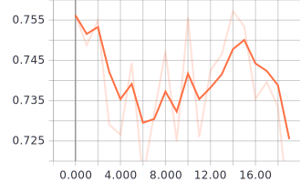

<h1>敵対的生成ネットワークから生成された画像を使ってMNISTを訓練</h1>

今回の実験の目的: 敵対的生成ネットワークをデータ拡張に応用できるのか試してみる。

敵対的生成ネットワークから生成された画像のみを使って分類器を訓練し、その性能を観察してみました。

<h2>学習の手順</h2>
<ol>
    <li>データを訓練データ、検証データ、テストデータに分割します。</li>
    <li>訓練データのみを用いて各数字を生成するネットワークを訓練します。</li>
    <li>各数字を生成するネットワークから生成された画像を用いて分類器を訓練します。</li>
</ol>

<h2>分類器の性能</h2>

訓練データに対する制度: 99~100%

検証データに対する制度: 70~75%

テストデータに対する制度: 70%

<small>※このページ末尾に今回学習させた分類器の結果と、同様の条件の下で元の画像を用いて学習させた分類器の結果を掲載してあります。</small>

以上の結果から、敵対的生成ネットワークから生成される画像に偏りがあると予想しました。

敵対的生成ネットワークをデータ拡張に応用するには生成されるデータに幅を持たせる必要があるかもしれません。

<h2>実験過程の画像やログ</h2>

generated_imagesフォルダには各数字を生成するネットワークが実際に生成した画像を格納してあります。

画像の末尾についている数字は、その画像を生成した時のイテレーション回数です。

modelsフォルダには敵対的生成ネットワークにおける生成者と識別者のモデルを格納してあります。

discriminatorが識別者、generatorが生成者です。

<h2>敵対的生成ネットワークが生成した画像を学習した分類器の結果</h2>
<figure>
    <figcaption>訓練データに対する制度</figcaption>
    
</figure>
<figure>
    <figcaption>訓練データに対する損失</figcaption>
    
</figure>
<figure>
    <figcaption>検証データに対する制度</figcaption>
    
</figure>
<figure>
    <figcaption>検証データに対する損失</figcaption>
    
</figure>
<h2>元の画像を学習した分類器の結果</h2>
<figure>
    <figcaption>訓練データに対する制度</figcaption>
    
</figure>
<figure>
    <figcaption>訓練データに対する損失</figcaption>
    
</figure>
<figure>
    <figcaption>検証データに対する制度</figcaption>
    
</figure>
<figure>
    <figcaption>検証データに対する損失</figcaption>
    
</figure>

